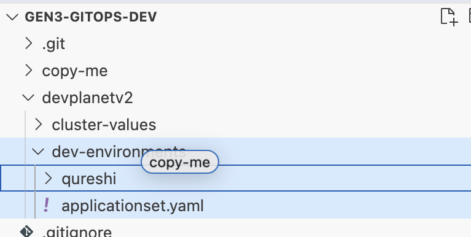
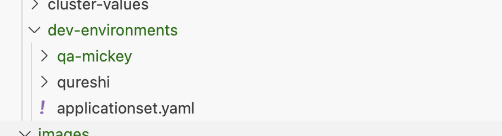
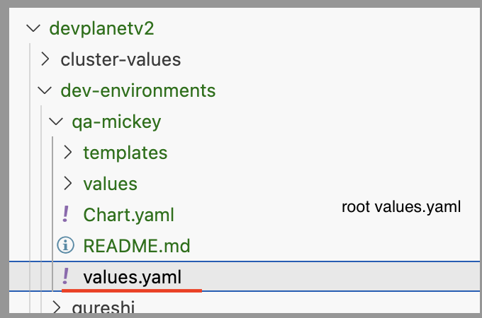
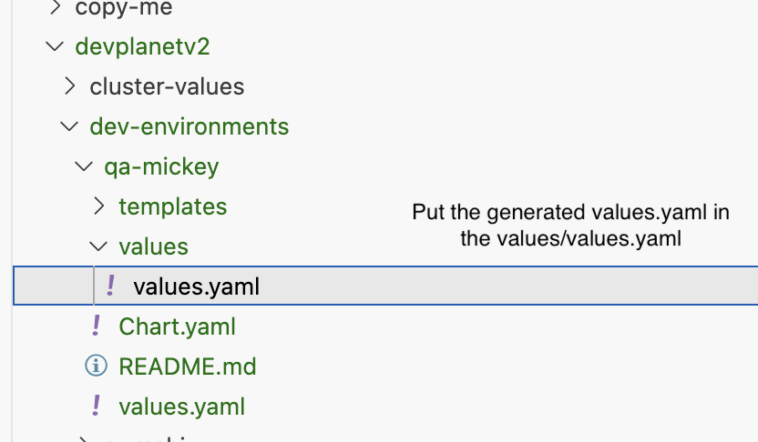

# Helm Migration Guide

## Prerequisites

### Access Your Admin VM
1. Log in to your adminvm
2. If the adminvm is not running, reach out to the security team to file an exception request

## Important Disclaimer

⚠️ **WARNING - CLOUD-AUTOMATION TO HELM MIGRATION SCRIPT** ⚠️

This script performs a **BEST EFFORT** migration of your current cloud-automation deployment to Helm. Please be aware of the following:

- This migration may not cover all edge cases or custom configurations
- After migration, you **MUST** thoroughly test ALL Gen3 functionality
- This script comes **WITHOUT ANY GUARANTEES** or warranties
- Always backup your current deployment before proceeding
- Review the generated Helm values carefully before deployment

**We need your help!** Please verify all edge-cases for all your services. If things are not working as expected, please raise PRs so we can collectively make this migration script as comprehensive as possible.

## Migration Process

### Running the Migration Script

The migration script will automatically create:
- A `values.yaml` file that can be checked into git
- Secrets in AWS Secrets Manager

To execute the migration in your environment:

```bash
cd cloud-automation
git checkout master
git pull
pip3 install boto3
python3 helm-migration-script/migrate-to-helm.py
```

This will generate a `values.yaml` file in the current folder. The actual filename will contain your hostname found in `Gen3Secrets/00configmap.yaml`, e.g. `aoliu.planx-pla.net`, so the filename is `aoliu.planx-pla.net-values.yaml`. Use `scp` to copy this file to your local machine for the next steps ("Deployment Process" below).

Example:

```bash
scp pauline@10.128.7.28:cloud-automation/pauline.planx-pla.net-values.yaml ~/Downloads/values.yaml
```

## Deployment Process

### Setting Up Your Environment

1. `git clone` this repository, and create a new local branch before making the following changes. 
2. **Copy the "copy-me" folder** into the "dev-environments" folder and rename it to match your environment name:
   ```
   cd gen3-gitops-dev
   cp -r copy-me devplanetv2/dev-environments/<your-env>
   ```

   

   **Rename the folder to match your env name**

   

3. **Update the copied values.yaml file** in the root of your new environment folder (not the one in values/values.yaml). Update the following fields:
   - `name:` - Change this to your environment name
   - `helmBranch:` - Set to your desired [Helm](http://github.com/uc-cdis/gen3-helm) branch
   - `gitopsBranch:` - Set to your desired [GitOps](http://github.com/uc-cdis/gen3-gitops-dev) branch




3. **Copy your migration values.yaml file** from the migration step to:
   ```
   gen3-gitops-dev/dev-environments/<your-env>/values/values.yaml
   ```


   

4. **Create a pull request** with your changes

5. **Wait for merge** - Once your PR is merged, the application will be automatically created using ArgoCD

## Next Steps

After deployment, ensure you:
- Test all Gen3 functionality thoroughly
- Monitor your services for any issues
- Document any problems or edge cases you encounter
- Contribute back to the migration script if you find gaps
