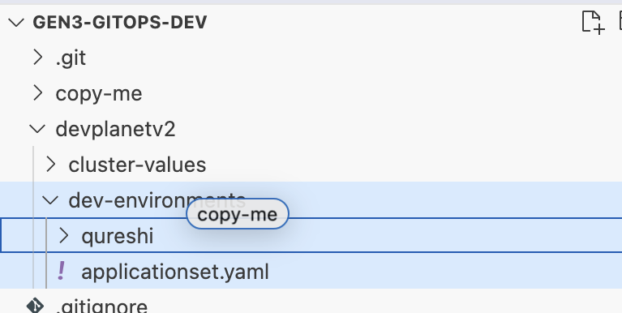
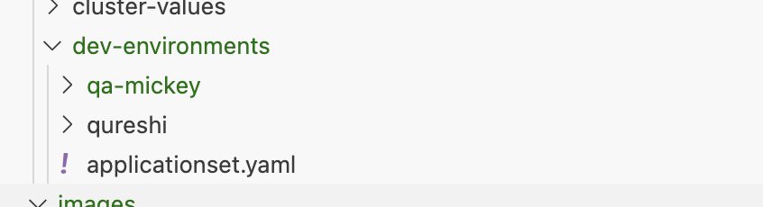
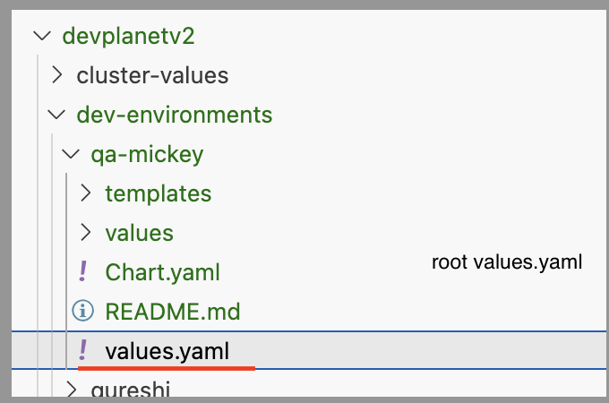

# Helm Migration Guide

## Prerequisites
Ensure the namespace you are attempting to create does not already exist in the devplanetv2 cluster.
If it does go ensure the developer is no longer using the [environment](https://github.com/uc-cdis/gitops-dev).
Hint, the namespace is likely NAMESPACE.planx-pla.net. If unused, delete the previous namespace before proceeding,
note older ingresses may not play nice and will need their finalizers removed.
(i.e. kubectl edit ingress -n NAMESPACE\_WITH\_CONFLICT) and set finalizers to `[]`, try deleting first though) 

### Setting Up Your Environment

1. `git clone` this repository, and create a new local branch before making the following changes. 
2. **Copy the "copy-me" folder** into the "dev-environments" folder and rename it to match your environment name:
   ```
   cd gen3-gitops-dev
   cp -r copy-me devplanetv2/dev-environments/<your-env>
   ```

   

   **Rename the folder to match your env name**

   

3. **Update the copied values.yaml file** in the root of your new environment folder (not the one in values/values.yaml). Update the following fields:
   - `name:` - Change this to your environment name
   - `helmBranch:` - Set to your desired [Helm](http://github.com/uc-cdis/gen3-helm) branch
   - `gitopsBranch:` - Set to your desired [GitOps](http://github.com/uc-cdis/gen3-gitops-dev) branch

search for `main` and `change me`



4. **Create a pull request** with your changes

5. **Wait for merge** - Once your PR is merged, the application will be automatically created using ArgoCD

6. **Autosync** - If autosync is not enabled you'll need to push the button in argocd's UI or run `argocd app sync gen3-dev-NAMESPCE`.

## Next Steps

After deployment, ensure you:
- Test all Gen3 functionality thoroughly
- Monitor your services for any issues
- Document any problems or edge cases you encounter
- Contribute back to the migration script if you find gaps
